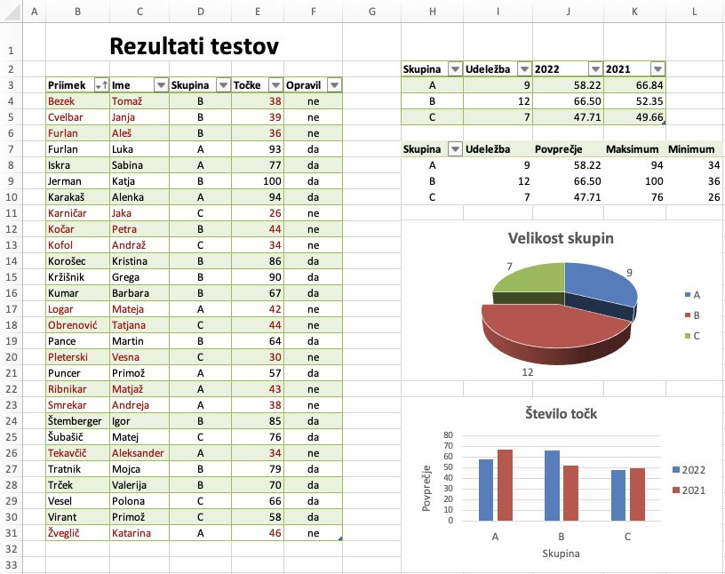
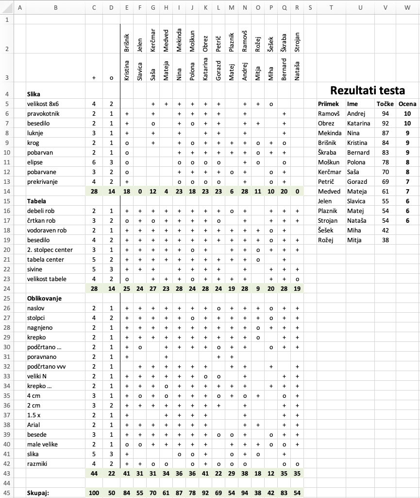

# Razpredelnice

`````{admonition} Programska oprema
:class: important
- [Excel](namestitev:microsoft)
`````

Ponavadi se izkaže, da ste se s programom Excel že kdaj prej spoznali,
zato bomo pri vajah skočili na naprednejše teme.
Predpostavljamo, da znate začetna poglavja 
[vodiča po Excelu](https://support.microsoft.com/en-us/office/what-is-excel-94b00f50-5896-479c-b0c5-ff74603b35a3),
do vključno poglavja o diagramih ("Charts"), od tega pri poglavju "Formulas & functions" le razdelek "Overview of formulas in Excel"; 
Še posebej pomembno je, da znate:

- urejati stolpce, vrstice in liste zvezka, izbirati in premikati celice in razpone celic,
- urejati tabele in diagrame,
- znate [kopirati vsebino celic z okvirčkom](https://support.microsoft.com/en-us/office/fill-data-automatically-in-worksheet-cells-74e31bdd-d993-45da-aa82-35a236c5b5db), 
- narediti [sklic na drugo celico ali razpon celic](https://support.microsoft.com/en-us/office/overview-of-formulas-in-excel-ecfdc708-9162-49e8-b993-c311f47ca173),

Kljub temu bomo na vajah nekaj pozornosti posvetili nekaterim pomembnim temam iz teh poglavij:

- [pretvarjanje besedila v stolpce](https://support.microsoft.com/en-us/office/split-text-into-different-columns-with-the-convert-text-to-columns-wizard-30b14928-5550-41f5-97ca-7a3e9c363ed7) in
- [uvoz podatkov iz datotek](https://support.microsoft.com/en-us/office/import-or-export-text-txt-or-csv-files-5250ac4c-663c-47ce-937b-339e391393ba),
- [pogojno oblikovanje](https://support.microsoft.com/en-us/office/conditional-formatting-7957ee2d-c54e-4230-961f-175fad32972c),

## Datoteke z nalogami

1. Za vajo lahko doma rešujete [uvodne naloge iz Excela](10-razpredelnice/excel-uvodne.zip).
2. Datoteke za vaje najdete v arhivu [`10-razpredelnice.zip`](10-razpredelnice/10-razpredelnice.zip).

## Rezultati

V zvezku `rezultati.xlsx` so zbrani rezultati testa, ki so ga študenti
pisali v treh skupinah.



1.  Odstranite stolpec `H` in študente uredite naraščajoče po
    priimkih.
2.  V stolpcu `F` s funkcijo `IF` sestavite formulo, ki pove, ali
    ima študent vsaj $50$ točk. V stolpcu `I` sestavite formulo, ki
    prešteje, koliko študentov je pisalo test v vsaki skupini (uporabite
    `COUNTIF`). V stolpcu `J` s funkcijo `AVERAGEIF` izračunajte
    povprečno število točk za vsako skupino. Rezultat naj bo izpisan na
    dve decimalki (ne zaokrožen).
3.  Tabelo podobno zgornji sestavite še z vrtilno tabelo. Prikažite
    udeležbo, povprečje, minimalno ter maksimalno število točk. *Namig:*
    polje Točke lahko v vrednostih vrtilne tabele uporabite več kot
    enkrat, z različnimi funkcijami združevanja.
4.  Sestavite 3D tortni diagram z udeležbo po skupinah. Odmaknite
    največji kos in dodajte oznake z udeležbo. Sestavite stolpični
    diagram s povprečji točk po skupinah za leti 2021 in 2022. Popravite
    število decimalk na navpični osi, dodajte oznake osi in legendo.
5.  Točke manjše od $50$ s pogojnim oblikovanjem pobarvajte rdeče, prav
    tako pa tudi priimke in imena študentov, ki niso opravili testa.
    *Namig:* v meniju za pogojno oblikovanje poiščite **New Rule** in izberite slog
    **Classic** ter oblikovanje s formulo: `$E3<50`.

## Smučanje (vrtilna tabela)

V datoteki `smucanje.csv` so zbrani podatki o skupnih zmagah v
svetovnem pokalu v alpskem smučanju. Podatki so ločeni z vejicami,
uporabljena je kodna tabela `UTF-8`. Podatke uvozite v delovni zvezek
`smucanje.xlsx` na list `Podatki`. 
Tabelo z uvoženimi podatki poimenujte `Zmagovalci`. 

1.  [Poglejte](https://support.microsoft.com/en-us/office/create-a-pivottable-to-analyze-worksheet-data-a9a84538-bfe9-40a9-a8e9-f99134456576), 
    kako se v Excelu naredi vrtilno tabelo.
2.  Naredite nov list `Zmage` na katerem sestavite vrtilno tabelo in diagram, 
    kot je prikazano na sliki.
    Pri izbiri podatkov za vrtilno tabelo lahko napišete kar `Podatki!Zmagovalci`.
3.  Prva vrtilna tabela naj vsebuje pregled zmag po državah in spolu
    tekmovalcev. Vrtilno tabelo poimenujte `PoDrzavah`. Tabelo uredite
    padajoče po skupnem številu zmag.
4.  Druga vrtilna tabela naj prikazuje zmagovalce iz Evrope, ki so zmagali
    vsaj dvakrat. Ustrezen filter najdete v meniju, ki vam ga odpre gumb za
    filtriranje v glavi tabele. Izberite ustrezno polje in uredite
    filtriranje po vrednost. Te razdelite na moške in ženske kot prikazuje
    slika in tabelo uredite padajoče po skupnem številu zmag.


## Poraba (`MATCH` in `INDEX`)

V delovnem zvezku `poraba.xlsx` so vpisani podatki o tem, kdaj in
koliko goriva smo dotočili v avto. Predpostavite, da gorivo vedno
dotočimo do polnega.

1.  Izračunajte prevožene kilometre (pri tem izpustite prvo vrstico).
    Gumbe v glavi tabele lahko skrijete na zavihku *Table* (možnost
    *Filter Button*).
2.  S pomočjo funkcij `MATCH` in `INDEX` izračunajte ceno natočenega
    goriva.
3.  Porabo (litre na 100 km) izračunate po formuli
    $100 \cdot \frac{\text{litri}}{\text{prevoženo}}$.
4.  V zadnjem stolpcu grafično prikaži porabo. S formulo kopirajte
    vrednost iz stolpca Poraba. Za zadnji stolpec uporabite pogojno
    oblikovanje: **Conditional Formatting** > **Highest Value**. 
    Za *minimum* in *maksimum* iz menija izberite *Lowest
    Value* in *Highest Value*.
5.  Sestavite vrtilno tabelo s pregledom prevoženih kilometrov in porabe
    po mesecih. Stolpec skupno lahko skrijete na zavihku *Design*.


## Točkovanje (dodatna naloga)

V delovnem zvezku `tockovanje.xlsx` so zbrani podatki o točkovanju
testa, ki so ga pisali študenti. Vsaka naloga je bila točkovana s
plusom, krogcem ali minusom (minusi v tabelo niso vpisani), vrednosti
plusa in krogca pa so različne pri posameznih nalogah.



1.  Stolpce uredite tako, da bodo priimki študentov urejeni po abecednem
    vrstnem redu: **Data** > **Sort**, pod **Options** pa izberete **Sort from left to right**. 
    Ni nujno, da se bodo šumniki uredili pravilno, to je za zdaj ok.
2.  Na obarvanih poljih (vrstice 14, 24, 43 in 45), izračunajte dosežene
    točke s funkcijama `SUM` in `SUMIF`. Formule najprej sestavite
    za enega študenta in jih kopirajte k drugim.
3.  Pod "Rezultati testa" kopirajte imena, priimke in dosežene
    točke (vrednosti, ne formul): uporabite menija **Copy** in **Paste Special**.
4.  Študente uredite padajoče po doseženih točkah in izračunajte ocene.

## Domača naloga

1. Rešite [Excel](10-razpredelnice/dn-excel.zip) nalogo,
   da dobite občutek, kako bodo izgledale naloge na izpitu.
   Na pravem izpitu bo morda naloga nekoliko težja, ker boste že več znali.
   Nalogo poskusite rešiti v največ 20 minutah.
2. Oddajte datoteko `⟨ime⟩-⟨priimek⟩.xlsx`
   (ustrezno popravite; če imate v imenu ali priimku kak presledek, ga nadomestite z vezajem `-`)
   [na učilnico do ponedeljka, 23. decembra 2024, ob 23:55](https://ucilnica.fmf.uni-lj.si/mod/assign/view.php?id=71491).

Točka za domačo nalogo se vam bo upoštevala, če boste pravočasno
oddali pravilno poimenovano Excel datoteko.

Datoteke oddane do roka bomo pregledali, da vidite, kako se ocenjuje na izpitu.
